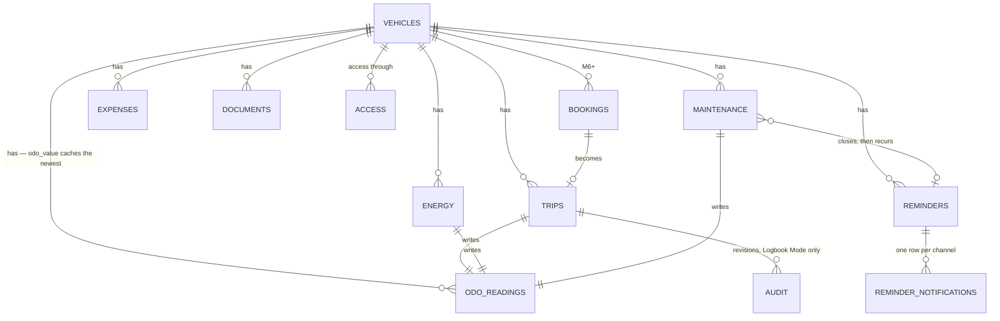

# Architecture

Part of the [NextFleet plan](../plan.md). Terms are defined in [CONTEXT.md](../CONTEXT.md).

## Stack and layers

Standard Nextcloud app, no external services.

- **PHP:** the intersection of what NC 31–34 support — confirmed at M0, let CI decide. Public `OCP`
  API only (app store rule). Layers: Controller → Service → QBMapper → Entity. Migrations via
  `OCP\Migration\SimpleMigrationStep`.
- **Vue 3 + Vite** (`@nextcloud/vite-config`, `@nextcloud/vue`), Pinia for state. **One bundle for
  the whole supported range** — proving that is the M0 gate ([plan](../plan.md#milestones)).
- **One API surface in v1**: the internal route set the web UI uses
  ([ADR 0006](adr/0006-one-api-surface-in-v1.md)). The versioned OCS API and `GET /sync?since=`
  arrive with the Android client that consumes them. Until then, controllers stay thin and every
  rule lives in a service, which is what makes that layer cheap to add later.
- **Target:** Nextcloud 31 → 34 (`min-version`/`max-version` in `appinfo/info.xml`). App id
  `nextfleet` (lowercase, matches folder name; must not contain "Nextcloud"). Licence
  AGPL-3.0-or-later.

## Data model

Odometer is **not** a field you edit. It is derived: every Entry that knows a mileage writes a
Reading, and the vehicle carries the latest value as a cache. That keeps trips, fill-ups and
maintenance from drifting apart.

Tables (prefix `fleet_`; Nextcloud prepends `oc_`, so names stay under 27 characters):

| Table | Key columns |
|---|---|
| `fleet_vehicles` | `user_id` (owner), `plate`, `manufacturer`, `model`, `vehicle_type`, `engine`, `energy_types`, `tank_ml`, `battery_wh`, `first_reg`, `vin`, `odo_value` (cache), `odo_unit` (km/h), `purchase_price`, `residual_est`, `currency`, `jurisdiction`, `logbook_mode`, `lifecycle`, `disposed_at`, `folder_file_id`, `retention_months`, `color`, `notes` |
| `fleet_odo_readings` | `vehicle_id`, `read_at`, `value`, `kind` (reading/reset/correction), `origin` (observed/derived), `flagged`, `source_type` (manual/trip/energy/maintenance), `source_id` |
| `fleet_trips` | `vehicle_id`, `started_at`, `ended_at`, `start_odo` (nullable claim), `end_odo`, `distance`, `cost_center`, `from_label`, `to_label`, `purpose`, `partner`, `category` (business/private/commute), `driver_uid`, `reconciled` |
| `fleet_energy` | `vehicle_id`, `filled_at`, `odo`, `energy` (petrol/diesel/lpg/cng/electric), `amount` (ml or Wh, per `energy`), `unit_price`, `total`, `vat_rate`, `full_tank`, `missed_previous`, `station`, `is_dc`, `location_kind` (home/public) |
| `fleet_maintenance` | `vehicle_id`, `type` (service/repair/inspection/tyres/upgrade), `done_at`, `odo`, `title`, `vendor`, `cost`, `vat_rate`, `notes`, `reminder_id` |
| `fleet_expenses` | `vehicle_id`, `spent_at`, `category` (insurance/tax/toll/parking/fine/lease/other), `amount`, `vat_rate`, `notes` |
| `fleet_reminders` | `vehicle_id`, `template_key` (nullable — seeded templates translate, user titles do not), `title`, `due_date`, `due_odo`, `mode` (date/odo/either), `lead_days`, `lead_odo`, `recur_months`, `recur_odo`, `state`, `snoozed_until`, `cal_uid`, `cal_uri` |
| `fleet_reminder_notifications` | `reminder_id`, `channel` (app/mail/calendar), `sent_at` |
| `fleet_documents` | `vehicle_id`, `file_id`, `kind` (registration/insurance/manual/receipt/photo), `linked_type`, `linked_id` |
| `fleet_audit` | `entity`, `entity_id`, `user_id`, `changed_at`, `diff_json` — only written under Logbook Mode |
| `fleet_access` | `vehicle_id`, `grantee`, `grantee_type` (user/group), `role` (manager/driver/viewer) |
| `fleet_bookings` *(M6+)* | `vehicle_id`, `user_id`, `starts_at`, `ends_at`, `purpose`, `state` |

Money as integer cents, distances as integer km, volumes as integer millilitres, energy as integer
watt-hours. No floats. Money also needs a `currency`, and business users need `vat_rate` — a report
that mixes net and gross is useless for accounting.

**`vat_rate` is nullable and null means "not stated".** Never zero. A receipt without a VAT line and
a genuinely zero-rated cost are different facts, and a report that conflates them is the mixed
net/gross failure by another route.

**No column is named after a unit it might not hold.** The odometer columns are `odo`, not `km`,
because a tractor counts hours; `fleet_energy.amount` means millilitres or watt-hours and says which
in `energy`, because a plug-in hybrid has both kinds of row. The table is `fleet_energy` and not
`fleet_fuel` for exactly the same reason.

**`engine` classifies, `energy_types` decides.** `engine` (petrol/diesel/lpg/cng/electric/hybrid) is
for display, filtering and emission defaults. `energy_types` is the set the vehicle actually
accepts, and it is authoritative: it decides which options the entry sheet offers and which
consumption figures exist. A plug-in hybrid is `hybrid` / `[petrol, electric]`.

**`tank_ml` and `battery_wh` exist only to flag implausible amounts** — sixty litres into a
forty-five-litre tank. They never constrain a save.

**The plate is a label, the `uuid` is the identity.** Cars get re-registered and plates get
transferred; changing one renames the vehicle, leaves an audit row, and breaks no history. The same
rule governs the vehicle's document folder: `folder_file_id` is the identity, the path is decoration
([Nextcloud integration](#nextcloud-integration)).

**`lifecycle` replaces an `active` flag.** `active`, `laid_up` (seasonal or off the road — reminders
pause), `disposed` (sold or scrapped, with `disposed_at` — reminders stop, the vehicle leaves the
overview, records stay for the retention period). A boolean cannot tell a Saisonkennzeichen from a
scrapyard.

There is deliberately **no `hu_due` column**. The next inspection is a reminder produced by an
inspection scheme ([contributing](contributing.md)) — a German date in a core table would be a
second source of truth and a country the core is not supposed to know.

**Every table carries** `uuid`, `created_at`, `updated_at`, `deleted_at` (soft delete),
`created_by`. `uuid` is identity, `updated_at` powers optimistic concurrency
([below](#concurrency)) and offline sync later, `deleted_at` gives users a trash and gives GDPR
erasure something explicit to purge. A jurisdiction that needs its own field adds a column in a
reviewed migration ([contributing](contributing.md)) — there is no catch-all JSON blob, because a
field that is not in the schema is a field nobody maintains. That rule is why notification receipts
are a table and not a column.

**Indexes are part of the schema, not an optimisation:** `(vehicle_id, <time column>)` on every
child table, `(user_id)` on vehicles, `(vehicle_id, read_at)` on readings, `(grantee)` on access.
QBMapper hides the query, not the missing index.

### Time

Every user-facing timestamp is two facts, not one
([ADR 0007](adr/0007-time-is-an-instant-plus-an-offset.md)): the UTC instant, plus `<name>_off`, the
originating UTC offset in minutes. A Fahrtenbuch is judged on local calendar dates, and a trip
ending 00:30 in Berlin belongs to the previous day in UTC.

- **Reporting and legal views derive the local date** from the pair. Ordering and durations use the
  instant.
- **`occurred_at` is the user's** — when the trip or fill-up happened, editable, part of the data.
- **`created_at` is the server's**, from `ITimeFactory`, never accepted from a client. Timeliness is
  the gap between the two, and the export can show it rather than pretending it is zero.
- Never call `time()` or `new DateTime()` in app code ([testing](development.md#testing)).

### Concurrency

An update sends the `updated_at` it read; a stale one is rejected with **412**, never silently
overwritten. Roughly ten lines in the base mapper. Two browser tabs are the realistic case today and
any later sync needs the same foundation. Trips under Logbook Mode cannot collide — they are
append-only.

The client also learns the server's clock: every response carries the server time in a header, and
the frontend keeps a running offset. That offset is a **diagnostic** — it lets the UI warn that a
device's clock is days out. It never rewrites what the user typed.

### Odometer rules

This is where logbooks quietly break. Six rules, decided once:

1. **Readings are ordered by `(read_at, id)`, never by value.** A trip entered three days late is
   dated three days back, not appended to the end.
2. `fleet_vehicles.odo_value` **caches** the newest reading in that order. Any read may recompute
   it; a nightly job does. Two drivers logging at once must not be able to corrupt a running total,
   so nothing is ever incremented in place.
3. **A lower reading is a flag, not an error.** Cluster swaps, engine changes and imports really do
   reset the counter — and the app cannot tell one from a typo. So the row is saved as `reading`,
   `flagged`, and the timeline offers the follow-up question: cluster swap, or a mistake? Until it
   is answered the flag stands and the segment is broken, exactly like `missed_previous`. Only an
   answered `reset` starts a new segment.
4. **`value` is km or engine hours**, per vehicle. Trailers count neither, tractors and generators
   count hours. One nullable column now; every query rewritten later.
5. **An Entry writes exactly one Reading**, at the moment it happened: a trip at `ended_at`, a
   fill-up at `filled_at`, maintenance at `done_at`. A trip's `start_odo` is a *claim*, not a
   reading — comparing it with the previous reading is precisely what produces gap detection
   ([backlog](features.md#feature-backlog)).
6. **Observed beats derived.** A driver who enters a distance instead of an end odometer leaves
   `start_odo` null; the Reading written at `ended_at` is *(latest reading at or before
   `started_at`) + distance*, marked `origin = derived`. Consumption requires **observed** readings
   at both ends of a segment, which costs nothing because fill-ups always carry a real number. When
   a later observed reading contradicts the derived chain, the observed value wins and the derived
   rows are flagged — never silently corrected.

## Nextcloud integration

| Concern | Mechanism |
|---|---|
| Identity, ACL | `OCP\IUserSession`, `IGroupManager`. Every query runs through `VehicleAccess::may` from M1 on: owner, or a row in `fleet_access` with a sufficient role ([ADR 0001](adr/0001-own-access-table.md)). |
| Reminders → push | Own `TimedJob` (hourly) evaluates due reminders, then `OCP\Notification\IManager` + an `INotifier`. This is the reliable path: it works without the Calendar app. |
| Reminders → calendar | User picks one writable calendar in settings; we write real events with alarms through `OCP\Calendar\IManager` (`createEventBuilder()` → `createInCalendar()`, needs a calendar implementing `ICreateFromString`; app `dav` as dependency). Store `cal_uid` so we can re-write or cancel. Real events sync over CalDAV, so the phone rings without our app. |
| Reminders → mail | `OCP\Mail\IMailer` + `IEMailTemplate`, using the server's configured SMTP. Digest, not one mail per item. |
| Files, receipts | `OCP\Files\IRootFolder`. A vehicle's folder is created as `/Fleet/<plate> — <make model>/` for humans who browse Files, and then **referenced only by `folder_file_id`**. A plate change renames it best-effort; a failed rename, or a user who moved the folder themselves, breaks nothing. Documents are `file_id` too. |
| …but served by us | Downloads go **through our controller**, so access follows the vehicle's access grant, not the file's. Otherwise a receipt on a shared car is invisible to the other driver unless the owner shares their folder. A `file_id` survives a move but not a delete — handle the missing node instead of 500ing. |
| Talk (optional) | Post due items into a fleet room, only when the Talk app is present. M6+, cheap, and very much the reason someone runs Nextcloud. |
| Activity stream | `OCA\Activity` provider — optional, after v1. |
| Dashboard | `OCP\Dashboard\IAPIWidgetV2`: "next due" list. |
| Unified search | `OCP\Search\IProvider`: find a vehicle by plate. |
| Settings | Personal settings (calendar target, mail digest cadence, default jurisdiction). |
| CLI | `occ nextfleet:import`, `occ nextfleet:report` for scripting and imports. |

**Spike needed (M4):** `ICreateFromString` documents creation and cancellation, not update. Confirm
whether re-writing the same UID upserts. If not, cancel + recreate.

## Reminder engine

One rule set, used by HU/AU, oil change, insurance renewal, tyre swap, licence check.

1. A reminder is due by date, by odometer, or by whichever comes first.
2. `lead_days` / `lead_odo` define when it starts warning.
3. On trigger: in-app notification, calendar event (if configured), mail digest entry.
4. Completing it creates a `fleet_maintenance` record and, if recurring, spawns the next reminder
   from the **actual** completion date/km — not the planned one.
5. **Prediction needs data to be honest.** Predicted km/day comes from the last 90 days and requires
   a floor of 30 days and two readings. Below that, the UI says "not enough data yet" rather than
   inventing a date. An odometer reminder with no usable prediction stays odometer-only: no
   estimated date, no calendar event, no false precision.
6. **States:** `planned → warned → due → overdue → done`, plus `snoozed` and `dismissed`.
   **Dismissing skips this occurrence; the recurrence continues.** Ending it is deleting the
   reminder — an explicit act. Someone who dismisses one oil change does not mean "never again", and
   the alternative silently terminates a legal duty. Snooze is not a nicety either: a reminder you
   cannot postpone gets muted permanently, and then the app is lying to you.
7. **The calendar is a one-way projection.** The app is the source of truth and the event says so.
   Editing the event does not change the reminder; switching the target calendar cleans up the
   events left in the old one.
8. Notification receipts are per channel, in `fleet_reminder_notifications`, so a broken SMTP server
   does not silence the in-app notification — and so "what did we send, when" is a query.

The same prediction warns on leasing mileage overrun.

## Numbers: consumption, cost, emissions

Every fuel tracker gets this wrong at least once, so specify it before writing code.

**Consumption is only defined between two full tanks.** Take a full fill-up A and the next full
fill-up B: sum the amounts of every fill-up *after* A up to and including B, divide by
`odo(B) − odo(A)`, times 100. Partial fill-ups are aggregated into the segment, never divided on
their own, and a vehicle's first fill-up yields no consumption at all.

- A `missed_previous` flag (paid cash, forgot the receipt) **skips** the segment. So does a flagged
  or derived reading ([odometer rules](#odometer-rules)). A gap must produce no number rather than a
  wrong one.
- **Electric gets a second figure, not a broken first one.** There is no wall-side equivalent of a
  full tank: people charge to 80 %, at three different chargers, and never to 100 %. The segment
  rule stays as it is and simply rarely fires for electricity. Alongside it, show a **rolling
  wall-side kWh/100 km** over all charges in the period, labelled approximate and noted as
  including charging losses. Two honestly-labelled numbers beat one that is silently wrong on most
  rows.
- **EVs count from the wall.** kWh drawn ≠ kWh stored — AC charging loses 10–20 %. Home vs. public
  is a separate dimension, not a correction factor.
- **Hybrids show both figures side by side**, driven by `energy_types`. A blended number means
  nothing to anybody.

**Cost per km** = energy + maintenance + expenses in the period ÷ km driven in the period. Show it
next to energy-only cost per km; the distance between the two is the actual story of the vehicle.

**TCO** adds depreciation: (purchase − estimated residual) ÷ km over the holding period. Both fields
are optional, and an empty field hides the KPI rather than inventing it. This is the number that
decides buy vs. lease, and none of the tools in
[the prior art](features.md#what-existing-tools-teach-us) shows it.

**Nothing is summed across currencies or units.** Currency and `odo_unit` are per vehicle. A
cross-vehicle report groups by both and shows sections — never a total, and no FX conversion, ever.
KPI labels derive from the vehicle (`€/km`, `€/h`), and a vehicle with no distance counter shows
cost per period instead.

**CO₂** = amount × emission factor per energy type, from a versioned table in code with the source
cited; electricity uses a configurable grid factor. Always labelled an estimate. Under the generic
jurisdiction there are no factors, so the figure is unavailable rather than zero.

**VAT:** store gross plus `vat_rate`, derive net — on energy, maintenance and expenses alike. A
freelancer's largest reclaimable VAT is a workshop invoice, not a tank of diesel.
