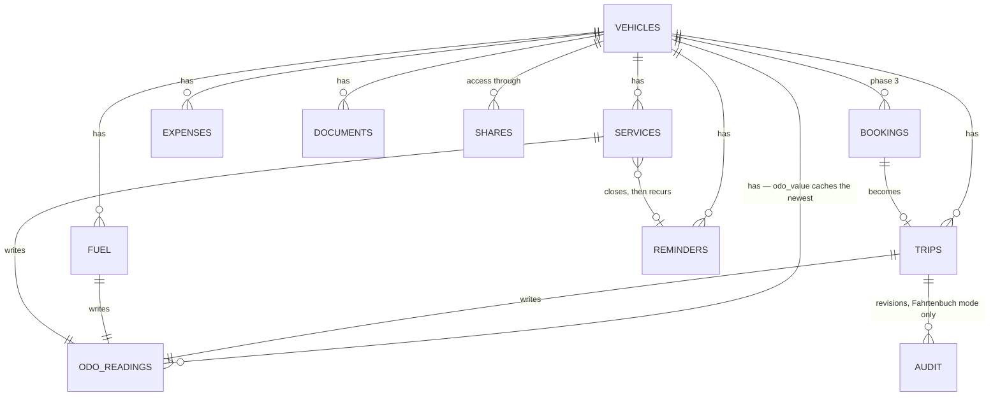

# Architecture

Part of the [NextFleet plan](../plan.md).

## Stack and layers

Standard Nextcloud app, no external services.

- **PHP:** the intersection of what NC 31–34 support — confirm at M0, let CI decide. Public `OCP`
  API only (app store rule). Layers: Controller → Service → QBMapper → Entity. Migrations via
  `OCP\Migration\SimpleMigrationStep`.
- **Vue 3 + Vite** (`@nextcloud/vite-config`, `@nextcloud/vue`), Pinia for state.
- **Two API surfaces:** an internal route set for the web UI, and a versioned **OCS API**
  (`/ocs/v2.php/apps/nextfleet/api/v1/...`) for the future Android app. Build both from day one; the
  web UI eats its own dogfood.
- **Design the OCS API for an offline client now.** A client-generated `uuid` as create identity (so
  a retried request is idempotent), a monotonic `updated_at` per row, tombstones instead of hard
  deletes, and one `GET /sync?since=<token>` delta endpoint. Three columns today; a data migration
  and a conflict model if we bolt it on in M7.
- **Target:** Nextcloud 31 → 34 (`min-version`/`max-version` in `appinfo/info.xml`; the store allows
  latest + 1). App id `nextfleet` (lowercase, matches folder name; must not contain "Nextcloud").
  License AGPL-3.0-or-later.

## Data model

Odometer is **not** a field you edit. It is derived: every record that knows a mileage writes an
odometer reading, and the vehicle carries the latest value as a cache. That keeps trips, fuel-ups
and services from drifting apart.

Tables (prefix `fleet_`; Nextcloud prepends `oc_`, so names stay under 27 characters):

| Table | Key columns |
|---|---|
| `fleet_vehicles` | `user_id` (owner), `plate`, `manufacturer`, `model`, `vehicle_type`, `engine` (petrol/diesel/electric/hybrid), `tank_ml`, `battery_wh`, `first_reg`, `vin`, `odo_value` (cache), `odo_unit` (km/h), `purchase_price`, `residual_est`, `currency`, `jurisdiction`, `active`, `color`, `notes` |
| `fleet_odo_readings` | `vehicle_id`, `read_at`, `value`, `kind` (reading/reset/correction), `source_type` (manual/trip/fuel/service), `source_id` |
| `fleet_trips` | `vehicle_id`, `started_at`, `ended_at`, `start_odo`, `end_odo`, `cost_center`, `from_label`, `to_label`, `purpose`, `partner`, `category` (business/private/commute), `driver_uid` |
| `fleet_fuel` | `vehicle_id`, `filled_at`, `odo`, `energy` (petrol/diesel/lpg/cng/electric), `amount` (ml or Wh, per `energy`), `unit_price`, `total`, `vat_rate`, `full_tank`, `missed_previous`, `station`, `is_dc`, `location_kind` (home/public) |
| `fleet_services` | `vehicle_id`, `type` (service/repair/inspection/tyres/upgrade), `done_at`, `odo`, `title`, `vendor`, `cost`, `notes`, `reminder_id` |
| `fleet_expenses` | `vehicle_id`, `spent_at`, `category` (insurance/tax/toll/parking/fine/lease/other), `amount`, `notes` |
| `fleet_reminders` | `vehicle_id`, `template_key` (nullable — seeded templates translate, user titles do not), `title`, `due_date`, `due_odo`, `mode` (date/odo/either), `lead_days`, `lead_odo`, `recur_months`, `recur_odo`, `state`, `snoozed_until`, `cal_uid`, `cal_uri`, `notified` (JSON: channel → timestamp) |
| `fleet_documents` | `vehicle_id`, `file_id`, `kind` (registration/insurance/manual/receipt/photo), `linked_type`, `linked_id` |
| `fleet_audit` | `entity`, `entity_id`, `user_id`, `changed_at`, `diff_json` — only written in Fahrtenbuch mode |
| `fleet_shares` | `vehicle_id`, `share_with`, `share_type` (user/group), `role` (manager/driver/viewer) |
| `fleet_bookings` *(phase 3)* | `vehicle_id`, `user_id`, `starts_at`, `ends_at`, `purpose`, `state` |

Money as integer cents, distances as integer km, volumes as integer millilitres, energy as integer
watt-hours. No floats. Money also needs a `currency`, and business users need `vat_rate` — a report
that mixes net and gross is useless for accounting.

**No column is named after a unit it might not hold.** The odometer columns are `odo`, not `km`,
because a tractor counts hours; `fleet_fuel.amount` means millilitres or watt-hours and says which
in `energy`, because a plug-in hybrid has both kinds of row. A column called `_km` holding hours is
exactly the database whose numbers mean different things in different rows.

**The plate is a label, the `uuid` is the identity.** Cars get re-registered and plates get
transferred; changing one renames the vehicle and leaves an audit row, and breaks no history.

There is deliberately **no `hu_due` column**. The next inspection is a reminder produced by an
inspection scheme ([contributing](contributing.md)) — a German date in a core table would be a
second source of truth and a country the core is not supposed to know.

**Every table carries** `uuid`, `created_at`, `updated_at`, `deleted_at` (soft delete),
`created_by`. Soft delete gives users a trash and gives GDPR erasure something explicit to purge;
the rest is the offline-sync groundwork from [stack and layers](#stack-and-layers). A country that
needs its own field adds a column in a reviewed migration ([contributing](contributing.md)) — there
is no catch-all JSON blob, because a field that is not in the schema is a field nobody maintains.

**Indexes are part of the schema, not an optimisation:** `(vehicle_id, <time column>)` on every
child table, `(user_id)` on vehicles, `(vehicle_id, read_at)` on readings, `(share_with)` on shares.
QBMapper hides the query, not the missing index.

### Odometer rules

This is where logbooks quietly break. Five rules, decided once:

1. **Readings are ordered by `(read_at, id)`, never by value.** A trip entered three days late is
   dated three days back, not appended to the end.
2. `fleet_vehicles.odo_value` **caches** the newest reading in that order. Any read may recompute
   it; a nightly job does. Two drivers logging at once must not be able to corrupt a running
   total, so nothing is ever incremented in place.
3. **A lower reading is a flag, not an error.** Cluster swaps, engine changes and imports really do
   reset the counter. `kind` = `reset` starts a new segment; only `reading` rows take part in
   consumption maths. Everything else gets a "check this" badge instead of a rejected form.
4. **`value` is km or engine hours**, per vehicle. Trailers count neither, tractors and generators
   count hours. One nullable column now; every query rewritten later.
5. **A record writes exactly one reading**, at the moment it happened: a trip at `ended_at` with
   `end_odo`, a fill-up at `filled_at`, a service at `done_at`. A trip's `start_odo` is a *claim*,
   not a reading — comparing it with the previous reading is precisely what produces gap detection
   ([backlog](features.md#feature-backlog)).

## Nextcloud integration

| Concern | Mechanism |
|---|---|
| Identity, ACL | `OCP\IUserSession`, `IGroupManager`. Every query runs through one access check from M1 on: owner, or an entry in `fleet_shares` with a sufficient role. |
| Reminders → push | Own `TimedJob` (hourly) evaluates due reminders, then `OCP\Notification\IManager` + an `INotifier`. This is the reliable path: it works without the Calendar app. |
| Reminders → calendar | User picks one writable calendar in settings; we write real events with alarms through `OCP\Calendar\IManager` (`createEventBuilder()` → `createInCalendar()`, needs a calendar implementing `ICreateFromString`; app `dav` as dependency). Store `cal_uid` so we can re-write or cancel. Real events sync over CalDAV, so the phone rings without our app. |
| Reminders → mail | `OCP\Mail\IMailer` + `IEMailTemplate`, using the server's configured SMTP. Digest, not one mail per item. |
| Files, receipts | `OCP\Files\IRootFolder`, stored under `/Fleet/<plate>/…`, referenced by `file_id`. Versioning and preview come for free. |
| …but served by us | Downloads go **through our controller**, so access follows the vehicle's share, not the file's. Otherwise a receipt on a shared pool car is invisible to the other drivers unless the owner shares their folder. A `file_id` also survives a move but not a delete — handle the missing node instead of 500ing. |
| Talk (optional) | Post due items and handovers into a fleet room, only when the Talk app is present. Phase 3, cheap, and very much the reason someone runs Nextcloud. |
| Activity stream | `OCA\Activity` provider — optional, phase 2. |
| Dashboard | `OCP\Dashboard\IAPIWidgetV2`: "next due" list. |
| Unified search | `OCP\Search\IProvider`: find a vehicle by plate. |
| Settings | Personal settings (units, calendar target, mail digest cadence, Fahrtenbuch mode). |
| CLI | `occ nextfleet:import`, `occ nextfleet:report` for scripting and imports. |

**Spike needed (M4):** `ICreateFromString` documents creation and cancellation, not update. Confirm
whether re-writing the same UID upserts. If not, cancel + recreate.

**Open question (M1, blocks the schema):** own `fleet_shares` table, or Nextcloud's
`OCP\Share\IManager` with a custom share provider? The share manager brings the share dialog users
already know, link shares, expiry dates, and circles for free — at the cost of fitting our roles
into its permission bits. Our own table is simpler and completely under our control. This decides
whether `fleet_shares` exists at all, so it is worth two days of spike before M1 rather than a
migration after M6.

## Reminder engine

One rule set, used by HU/AU, oil change, insurance renewal, tyre swap, licence check.

1. A reminder is due by date, by odometer, or by whichever comes first.
2. `lead_days` / `lead_odo` define when it starts warning.
3. On trigger: in-app notification, calendar event (if configured), mail digest entry.
4. Completing it creates a `fleet_services` record and, if recurring, spawns the next reminder from
   the **actual** completion date/km — not the planned one.
5. Predicted km/day from the last 90 days turns a km reminder into an estimated date, so a
   "next service in 3 000 km" shows up in the calendar too.
6. **States:** `planned → warned → due → overdue → done`, plus `snoozed` and `dismissed`. Snooze is
   not a nicety — a reminder you cannot postpone gets muted permanently, and then the app is lying
   to you.
7. **The calendar is a one-way projection.** The app is the source of truth and the event says so.
   Editing the event does not change the reminder; switching the target calendar cleans up the
   events left in the old one.
8. `notified_at` is per channel, so a broken SMTP server does not silence the in-app notification.

The same prediction warns on leasing mileage overrun.

## Numbers: consumption, cost, emissions

Every fuel tracker gets this wrong at least once, so specify it before writing code.

**Consumption is only defined between two full tanks.** Take a full fill-up A and the next full
fill-up B: sum the litres of every fill-up *after* A up to and including B, divide by
`km(B) − km(A)`, times 100. Partial fill-ups are aggregated into the segment, never divided on
their own, and a vehicle's first fill-up yields no consumption at all.

- A `missed_previous` flag (paid cash, forgot the receipt) **skips** the segment. A gap must produce
  no number rather than a wrong one.
- **EVs count from the wall.** kWh drawn ≠ kWh stored — AC charging loses 10–20 %. Consumption is
  wall-side; home vs. public is a separate dimension, not a correction factor.
- **Hybrids need both figures side by side.** A blended number means nothing to anybody.

**Cost per km** = fuel + service + expenses in the period ÷ km driven in the period. Show it next to
fuel-only cost per km; the distance between the two is the actual story of the vehicle.

**TCO** adds depreciation: (purchase − estimated residual) ÷ km over the holding period. Both fields
are optional, and an empty field hides the KPI rather than inventing it. This is the number that
decides buy vs. lease, and none of the tools in
[the prior art](features.md#what-existing-tools-teach-us) shows it.

**CO₂** = amount × emission factor per energy type, from a versioned table in code with the source
cited; electricity uses a configurable grid factor. Always labelled an estimate. Nearly free once
fuel data exists, and increasingly something companies must report.

**VAT:** store gross plus `vat_rate`, derive net. Business users need both.
