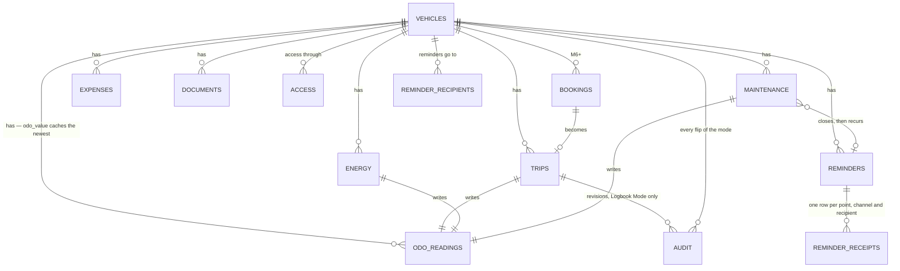

# Architecture

Part of the [NextFleet plan](../plan.md). Terms are defined in [CONTEXT.md](../CONTEXT.md).

## Stack and layers

Standard Nextcloud app, no external services.

- **PHP:** the intersection of what NC 31–34 support — confirmed at M0, let CI decide. Public `OCP`
  API only (app store rule). Layers: Controller → Service → QBMapper → Entity. Migrations via
  `OCP\Migration\SimpleMigrationStep`.
- **Vue 3 + Vite** (`@nextcloud/vite-config`, `@nextcloud/vue`), Pinia for state. **One bundle for
  the whole supported range** — proving that is the M0 gate ([plan](../plan.md#milestones)). One
  per *page*, though: the app's block on the user's settings page is a second entry, because
  mounting the fleet inside a settings section would load every view for one dropdown.
- **One API surface in v1**: the internal route set the web UI uses
  ([ADR 0006](adr/0006-one-api-surface-in-v1.md)). The versioned OCS API and `GET /sync?since=`
  arrive with the Android client that consumes them. Until then, controllers stay thin and every
  rule lives in a service, which is what makes that layer cheap to add later. The routes are in
  `appinfo/routes.php`; the JSON keys are the column names, so what a client reads back is what it
  may send — and what it may *not* send is stated once, in the service.
- **Target:** Nextcloud 31 → 34 (`min-version`/`max-version` in `appinfo/info.xml`). App id
  `nextfleet` (lowercase, matches folder name; must not contain "Nextcloud"). Licence
  AGPL-3.0-or-later.

## Data model

Odometer is **not** a field you edit. It is derived: every Entry that knows a mileage writes a
Reading, and the vehicle carries the latest value as a cache. That keeps trips, fill-ups and
maintenance from drifting apart.

Tables (prefix `fleet_`; Nextcloud prepends `oc_`, so names stay under 27 characters):

| Table | Key columns |
|---|---|
| `fleet_vehicles` | `user_id` (owner), `plate`, `manufacturer`, `model`, `vehicle_type`, `engine`, `energy_types`, `tank_ml`, `battery_wh`, `first_reg`, `vin`, `odo_value` (cache), `odo_unit` (km/h), `second_unit` (null/h), `second_value` (cache), `purchase_price`, `residual_est`, `currency`, `jurisdiction`, `logbook_mode`, `lifecycle`, `disposed_at`, `folder_file_id`, `retention_months`, `color`, `notes`, `reminder_mail` (off/daily/weekly/monthly, default weekly) |
| `fleet_odo_readings` | `vehicle_id`, `read_at`, `read_at_off`, `value`, `kind` (reading/reset/correction), `origin` (observed/derived), `flagged`, `source_type` (manual/trip/energy/maintenance), `source_id`, `counter` (main/second, null reads as main) |
| `fleet_trips` | `vehicle_id`, `started_at`, `started_at_off`, `ended_at`, `ended_at_off`, `start_odo` (nullable claim), `end_odo`, `distance`, `from_label`, `to_label`, `purpose`, `partner`, `category` (business/private/commute), `reconciled` |
| `fleet_energy` | `vehicle_id`, `filled_at`, `filled_at_off`, `odo`, `second_odo`, `energy` (petrol/diesel/lpg/cng/electric), `amount` (ml or Wh, per `energy`), `unit_price` (tenths of a cent per l or kWh), `total`, `vat_rate`, `full_tank`, `missed_previous`, `station`, `is_dc`, `location_kind` (home/public) |
| `fleet_maintenance` | `vehicle_id`, `type` (service/repair/inspection/tyres/upgrade), `done_at`, `done_at_off`, `odo`, `second_odo`, `title`, `vendor`, `cost`, `vat_rate`, `notes`, `reminder_id` (the reminder it closed) |
| `fleet_expenses` | `vehicle_id`, `spent_at`, `spent_at_off`, `category` (insurance/tax/toll/parking/fine/lease/other), `amount`, `vat_rate`, `notes` |
| `fleet_reminders` | `vehicle_id`, `template_key` (nullable — seeded templates translate, user titles do not), `title`, `mode` (date/odo/either), `due_date` (a plain date), `due_odo`, `lead_odo`, `warn_month_before`, `warn_month_start`, `warn_due_date`, `recur_months`, `recur_odo`, `state`, `snoozed_until`, `occurrence` (counts up with each recurrence) |
| `fleet_reminder_receipts` | `reminder_id`, `occurrence`, `point`, `channel` (app/mail), `user_id`, `sent_at` — unique per send |
| `fleet_reminder_recipients` | `vehicle_id`, `user_id` — unique per vehicle; starts as the owner |
| `fleet_documents` | `vehicle_id`, `file_id`, `kind` (registration/insurance/manual/receipt/photo), `linked_type`, `linked_id` |
| `fleet_audit` | `entity`, `entity_id`, `diff_json` — only written under Logbook Mode |
| `fleet_access` | `vehicle_id`, `grantee`, `grantee_type` (user/group), `role` (manager/driver/viewer) |
| `fleet_bookings` *(M6+)* | `vehicle_id`, `user_id`, `starts_at`, `ends_at`, `purpose`, `state` |

Money as integer cents, distances as integer km, volumes as integer millilitres, energy as integer
watt-hours. No floats. A unit price is the one exception to cents: pumps price to a tenth of a cent,
so `unit_price` counts tenths. Money also needs a `currency`, and business users need `vat_rate` — a report
that mixes net and gross is useless for accounting.

**`vat_rate` is nullable and null means "not stated".** Never zero. A receipt without a VAT line and
a genuinely zero-rated cost are different facts, and a report that conflates them is the mixed
net/gross failure by another route.

**No column is named after a unit it might not hold.** The odometer columns are `odo`, not `km`,
because a tractor counts hours; `fleet_energy.amount` means millilitres or watt-hours and says which
in `energy`, because a plug-in hybrid has both kinds of row. The table is `fleet_energy` and not
`fleet_fuel` for exactly the same reason.

**`engine` classifies, `energy_types` decides.** `engine` (petrol/diesel/lpg/cng/electric/hybrid) is
for display, filtering and emission defaults. `energy_types` is the set the vehicle actually
accepts, and it is authoritative: it decides which options the entry sheet offers and which
consumption figures exist. A plug-in hybrid is `hybrid` / `[petrol, electric]`. A fill-up of an
energy outside the set is saved and flagged, as one without a total is flagged "no price"; both
flags are computed on read (`EnergyService::flags()`), never stored.

**`tank_ml` and `battery_wh` exist only to flag implausible amounts** — sixty litres into a
forty-five-litre tank. They never constrain a save. The flag is `overfilled`, computed on read like
the others: an electric amount against `battery_wh`, any other against `tank_ml`, and nothing when
the capacity is not on file.

**The plate is a label, the `uuid` is the identity.** Cars get re-registered and plates get
transferred; changing one renames the vehicle, leaves an audit row, and breaks no history. The same
rule governs the vehicle's document folder: `folder_file_id` is the identity, the path is decoration
([Nextcloud integration](#nextcloud-integration)).

**`lifecycle` replaces an `active` flag.** `active`, `laid_up` (seasonal or off the road — reminders
pause), `disposed` (sold or scrapped, with `disposed_at` — reminders stop, the vehicle leaves the
overview, records stay for the retention period). A boolean cannot tell a Saisonkennzeichen from a
scrapyard.

**An audit row's author and instant are `created_by` and `created_at`.** It is written in the same
transaction as the change it records and never updated, so a `user_id` and a `changed_at` of its own
would be two more places for one fact to disagree. What kind of change it was — a void, the undo of
one, a late edit, a mode flip, a reconciliation — is in `diff_json` and not in a column: the trail
has to describe tables that do not exist yet. **An undo is a change too**: a trail that stopped at
the void would say "voided" over a trip the export lists as driven, and nothing would say which of
the two happened last.

**`diff_json` is `{"change": …, "fields": {…}}`**, each field a `[before, after]` pair. A creation's
pairs all start at null; a field nobody stated is not in them, because a diff that lists what did not
change buries what did. Anything the change itself carried — that an edit was late, that a trip was
derived rather than observed — is a further key beside those two. The words so far: `created`,
`edited`, `voided` and `restored` (each always with `late`, true or false) and `switched`. A Reconciliation
Trip is `created` with `derived: true`. An edit that changed nothing writes no row.

There is deliberately **no `hu_due` column**. The next inspection is a reminder produced by an
inspection scheme ([contributing](contributing.md)) — a German date in a core table would be a
second source of truth and a country the core is not supposed to know.

**Every table carries** `uuid`, `created_at`, `updated_at`, `deleted_at` (soft delete),
`created_by`. `uuid` is identity, `updated_at` powers optimistic concurrency
([below](#concurrency)) and offline sync later, `deleted_at` gives users a trash and gives GDPR
erasure something explicit to purge. A jurisdiction that needs its own field adds a column in a
reviewed migration ([contributing](contributing.md)) — there is no catch-all JSON blob, because a
field that is not in the schema is a field nobody maintains. That rule is why notification receipts
are a table and not a column. It also carries a `<name>_off` for each of its user-facing instants
([Time](#time)); the table above spells those out only for the tables that exist.

**Nothing purges yet.** Deleting a vehicle stamps its `deleted_at` and touches no other row: its
readings, trips, fill-ups, maintenance records, expenses, reminders, receipts, recipients and
access grants stay as they were, so an undo brings the vehicle back whole. No route, `occ` command
or job removes a row. The one hard delete is taking a recipient off a list
([Who is told](#reminder-engine)), which is not a vehicle delete. Opt-in retention will be the
first purge, and must then take the vehicle's child rows with it.

**Deleting a Nextcloud account pseudonymises, it purges nothing**
([ADR 0008](adr/0008-erasing-a-driver-pseudonymises.md)). `UserDeletedListener` hands the uid to
`ErasureService`, which replaces it with one random `erased-…` pseudonym on every table, in one
transaction: `created_by` everywhere, a vehicle's owner `user_id`, a receipt's `user_id` and a user
grant's `grantee`. Ownership and grants are renamed too because Nextcloud lets a deleted uid be
taken again, and the new account must inherit nothing. The account's reminder-list entries are the
rows that go: a deleted account receives nothing. A new table that names an account says so in its
mapper's `accountColumns()` and joins `ErasureService`'s list.

**A boolean column is nullable and carries a default.** Nextcloud's schema check refuses a `NOT NULL`
boolean outright — it is an integer of length 1 on the databases it supports — and NC 31 enforces
that where NC 34 no longer does. The default is what a flag nobody touched means.

**Indexes are part of the schema, not an optimisation:** a unique index on `uuid` everywhere, so the
database states the identity too; `(vehicle_id, <time column>)` on every child table, `(user_id)` on
vehicles, `(vehicle_id, read_at)` on readings, `(vehicle_id, started_at)` on trips, `(grantee)` on
access, `(entity, entity_id)` on the audit trail, which hangs off a row rather than a vehicle.
QBMapper hides the query, not the missing index.

### Time

Every user-facing timestamp is two facts, not one
([ADR 0007](adr/0007-time-is-an-instant-plus-an-offset.md)): the UTC instant, plus `<name>_off`, the
originating UTC offset in minutes. A Fahrtenbuch is judged on local calendar dates, and a trip
ending 00:30 in Berlin belongs to the previous day in UTC.

- **Reporting and legal views derive the local date** from the pair. Ordering and durations use the
  instant.
- **The entry's own instant is the user's** — `read_at`, `ended_at`, `filled_at` — when it happened,
  editable, part of the data. A plain calendar date is one fact and takes no offset: `first_reg` and
  `disposed_at` are days, not moments.
- **`created_at` is the server's**, from `ITimeFactory`, never accepted from a client. Timeliness is
  the gap between the two, and the export can show it rather than pretending it is zero.
- Never call `time()` or `new DateTime()` in app code ([testing](development.md#testing)).

### Concurrency

An update sends the `updated_at` it read; a stale one is rejected with **412**, never silently
overwritten. Roughly ten lines in the base mapper. Two browser tabs are the realistic case today and
any later sync needs the same foundation. Trips under Logbook Mode cannot collide — they are
append-only.

The token is `updated_at` itself, a unix second, and the statement that checks it is the statement
that writes: one `UPDATE … WHERE id = ? AND updated_at = ? AND deleted_at IS NULL`, matching nothing
when the row has moved on. It **always advances**, to at least one second past the token it
replaces, because two writes in the same second would otherwise leave the second one's token
looking fresh. Identity and provenance — `uuid`, `created_at`, `created_by` — are not writable
through an update at all.

**Undo is the one write that does not advance the token.** `POST /api/vehicles/{uuid}/restore` runs
`UPDATE … SET deleted_at = NULL WHERE id = ? AND updated_at = ? AND deleted_at IS NOT NULL`: the
same check, the mirror predicate, and `updated_at` left where the delete put it. The undo toast
holds exactly one token — the one the delete answered with — so moving it would refuse the gesture,
and nobody else can be holding it, because it was minted by the delete and never left that response.
A restore that matches nothing is a **412** like any other: either the row moved on, or it was never
deleted, and both mean what you read is not what is there.

**Recomputed columns stay out of it.** `fleet_vehicles.odo_value` and `fleet_odo_readings.flagged`
are derived from the readings ([odometer rules](#odometer-rules)), so each is written by a statement
of its own that moves neither `updated_at` nor the token. Otherwise an odometer entry would refuse
the vehicle sheet that happened to be open, and two entries arriving together would tell the second
one it lost a race it was never in.

On the wire the token is the vehicle's `updated_at`, and every write carries it back — a `PUT` in
the body, a `DELETE` in the query string. A write that arrives without one is a **400**: there is
nothing to check it against. **Nextcloud answers its own failed CSRF check with 412 too**, so a
client tells the two apart by the body, not by the status: ours carries `"conflict": true`, which
Nextcloud's never does. The client raises that as its own error type, so the sheet can stay open
with the values intact ([ui](ui.md#the-entry-sheet-in-detail)) — a CSRF failure would only repeat
itself on a retry.

The client also learns the server's clock: every response carries the server time in a header, and
the frontend keeps a running offset. That offset is a **diagnostic** — it lets the UI warn that a
device's clock is days out. It never rewrites what the user typed.

### Odometer rules

This is where logbooks quietly break. Six rules, decided once:

1. **Readings are ordered by `(read_at, id)`, never by value.** A trip entered three days late is
   dated three days back, not appended to the end.
2. `fleet_vehicles.odo_value` **caches** the newest reading in that order. Any read may recompute
   it; a nightly job does. Two drivers logging at once must not be able to corrupt a running total,
   so nothing is ever incremented in place. Recomputing alone is not enough: a write that read the
   chain before another's Reading committed would cache the older number, and could cache it last.
   So every write that recomputes holds the vehicle's row first, in its own transaction, with an
   `UPDATE` that changes nothing. A second writer waits for the first to commit and, at Nextcloud's
   READ COMMITTED, reads its Reading.
3. **A lower reading is a flag, not an error.** Cluster swaps, engine changes and imports really do
   reset the counter — and the app cannot tell one from a typo. So the row is saved as `reading`,
   `flagged`, and the timeline offers the follow-up question: cluster swap, or a mistake? Until it
   is answered the flag stands and the segment is broken, exactly like `missed_previous`. Only an
   answered `reset` starts a new segment.
4. **`value` is km or engine hours**, per vehicle. Trailers count neither, tractors and generators
   count hours. A km vehicle — a truck, say — may also count engine hours: `second_unit = h`
   switches on a second chain of Readings (`counter = second`; null reads as `main`). Each chain is
   ordered, flagged and cached on its own — `odo_value` for `main`, `second_value` for `second` —
   and a distance counts from its own chain. Trips, Gaps, Reconciliation Trips, Logbook Mode and the
   Fahrtenbuch read `main` only. An Odometer Entry on a two-counter vehicle says which counter it
   read. Switching it off clears the column and keeps the Readings. The main unit is never switched
   by picking a type once the vehicle has Readings, because their numbers mean what the unit meant
   when they were read.
5. **An Entry writes its Readings** at the moment it happened: a trip exactly one, at `ended_at`,
   on `main`; a fill-up at `filled_at` and maintenance at `done_at`, one per counter given and none
   without. A trip's `start_odo` is a *claim*, not a
   reading — comparing it with the Reading the last trip before it left is precisely what produces
   gap detection ([logbook mode](features.md#logbook-mode)). A Reading no trip wrote is not what
   the claim is compared with: it proves the counter moved and accounts for no kilometre. The Reading goes where its Entry goes: voiding the
   Entry voids the Reading and the undo brings both back, in one transaction. A Reading left
   standing on a voided trip would hold the vehicle's counter at a journey nobody claims any more,
   on a row the timeline no longer shows. An edit restates the same Reading in the same
   transaction: its date follows the journey's end, and its number is counted again only when the
   counter, the distance or the start changed. An edit to the end time, where the trip went or why
   leaves the number alone, so a counted value is never recounted behind the driver's back.
   A fill-up or maintenance record keeps one Reading row per counter through its edits
   (`OdometerService::followEntry()`): a changed counter or moment moves it, an emptied counter
   soft-deletes it, and a counter stated again brings the same row back. Its undo restores the
   Readings for the counters it stated when it was deleted, so one an earlier edit emptied stays
   gone. An Odometer Entry is its own Reading, so it is edited, deleted and restored as itself
   (`…/readings/{id}`); a Reading another Entry wrote is not found there, only through its Entry.
6. **Observed beats derived.** A driver who enters a distance instead of an end odometer leaves
   `start_odo` null; the Reading written at `ended_at` is *(latest reading at or before
   `started_at`) + distance*, marked `origin = derived`. Consumption requires **observed** readings
   at both ends of a segment; a fill-up without a counter has none, and its segment yields no number. When
   a later observed reading contradicts the derived chain, the observed value wins and the derived
   rows are flagged — never silently corrected. Winning is not an alibi: if that reading is still
   below the last row left standing, it is flagged too, and both questions get asked.

### The timeline

One vehicle, one timeline ([ui](ui.md)): every table that dates a row, merged into one order,
newest first, fifty rows at a time. `GET /api/vehicles/{uuid}/timeline`, `?type=` the chip and
`?cursor=` the scroll position.

**The merge is the server's, because the paging is.** A client that asked each table for fifty rows
would have to hold both to know which fifty come first, and that gets worse with every table M3
adds.

**The order is `(occurred_at, kind, id)`.** Two rows really do share an instant — a trip entered at
the moment the counter was read, an import that dates a day's rows alike — so the instant alone is
not a total order, and a page boundary that is not a total order silently drops a row or serves it
twice. `kind` breaks the tie between tables, `id` inside one. A kind ranks by its place in a fixed
list, never by its name, so that the merge and the cursor cannot end up ranking differently; a new
kind goes at the end of that list, because re-ordering it would re-order pages somebody is already
scrolling through.

**The cursor is that key**, `<instant>:<kind>:<id>`, and it is the server's own word handed back —
one a client invented names a place in an order it cannot see, so it is refused rather than read as
"start at the top". Each table is asked for fifty-one rows, which is what says whether a next page
exists; a page that answers with no cursor is the last one, so nobody fetches an empty page to find
out.

**A row is an Entry, not a written row.** A trip carries the Reading it left on the counter
([rule 5](#odometer-rules)), so the journey and the counter it moved are one row on screen — which
is why the Readings query selects only `source_type = 'manual'`, the Entries that are their own
Reading (CONTEXT.md). Listing the rest would show every trip twice. Voided rows are out of the read
entirely; the Fahrtenbuch export asks its own question.

A trip row also carries `missing`, the fields its ruleset requires and it leaves unstated
([logbook mode](features.md#logbook-mode)).

The kinds are `odometer`, `trip`, `energy`, `maintenance` and `expense`, ranked in that order. A
fill-up or maintenance row carries `readings`, the Readings it wrote (none to two, one per
counter), for the same reason a trip carries its one; they are looked up by `(source_type,
source_id)`, because an id is unique only inside its own table. A fill-up row carries `flags` as
well, and `consumption`: the segment it closes, or null
([numbers](#numbers-consumption-cost-emissions)). That is measured over the vehicle's whole energy
chain, since the fill-up that opened the segment may be pages away.

**One row reads back on its own**, `GET /api/vehicles/{uuid}/timeline/{type}/{id}`, in the same
shape. The entry sheet asks for it after an edit lost a race, for the token its _Save anyway_ writes
under ([ui](ui.md#the-entry-sheet-in-detail)). A Reading another Entry wrote is not a row, so it is
not found as an `odometer`.

**The Gaps are a route of their own**, `GET /api/vehicles/{uuid}/gaps`, and are not paged. A month
header states the whole month's, and a figure that grew as rows scrolled in would state a number
that is not true yet. Each Gap names the trip that opened it, the distance and the two moments that
bracket it. The screen sums them per month and reads them only under Logbook Mode.

**A Gap is closed** by `POST /api/vehicles/{uuid}/gaps/{trip}/close`, carrying the distance and the
two moments the driver confirmed. The server finds the Gap again and closes it only if all three
still match; otherwise it answers 412 `conflict`, like a stale token. It holds the vehicle's row
before it looks, so two confirmations of one Gap at once close it once and refuse the other. The
Reconciliation Trip runs from the Reading the Gap was measured against to the start of the trip
that claimed it and carries the Gap's distance, so rule 6 counts its Reading onto the claim and the
Gap is gone on the next read. That holds over an Entry between the two, which is why an Entry at
that Reading's own moment reading another number opens no Gap: rule 6 would count from the Entry.

`odometer#index` stays where it is. The counter's own chain — flags, segments, what the vehicle
stands at — is a different question from what happened to the vehicle.

### The Fahrtenbuch export

`GET /apps/nextfleet/vehicles/{uuid}/logbook/{year}` answers with the page itself, not with data for
one ([ADR 0005](adr/0005-no-pdf-library.md)), so it sits outside `/api`. The Reports screen opens it
by navigating to it, and learns which countries have a renderer from `logbook_export` on each
jurisdiction `GET /api/preferences` lists. A navigation carries no request token, so the route
takes none; it writes nothing, and Nextcloud still demands the same-site cookie. Like every export
it is rate-limited and logged by ids ([security](security.md)). Its policy allows inline style and
nothing else, so a renderer that broke its promise to load nothing still could not.

**The core decides what is in it, the country how it reads.** `LogbookExport` hands a
`LogbookReport` to the jurisdiction's `IReportRenderer`: the trips that set off in the year by their
local date ([time](#time)), voided ones included, each with what its ruleset finds missing and its
late changes, the periods the mode was on, and the ruleset's source URL. The periods are read off
the vehicle's flips ([logbook mode](features.md#logbook-mode)): the first flip's `before` says
whether the vehicle was created under the mode, and with no flip the column says it. A jurisdiction
with no renderer answers 404, not an empty page that would pass for a logbook.

**A late change is on its trip's line.** The law accepts later changes that are documented, and one
the auditor cannot see is not. So each line carries its trip's audit rows with `late: true`
(edits, voids and restores), read for the whole year in one batched query. The page says when, what
each edited field said before, and for a restore since when the trip had been voided: a restore
months later would otherwise erase the void without a trace. A late void is the line's own
`Storniert` note, stated once. A change inside the lock delay is still the entry being made and is
not listed. Each change also carries the trip's offsets as they stood before it, walked back from the
trip through every later row, so a time it replaced reads in the offset it was entered in.

**What the page says outside the mode.** Every trip in the year is listed, but only a trip that set
off inside a period states what it lacks. That is the app's one rule
([logbook mode](features.md#logbook-mode)) asked of the mode as it stood when the trip set off, not
as it stands now: the timeline answers for today, the export for a year, and an auditor must not
read "incomplete" on months no logbook was kept for. A period runs from its flip on up to, not including, its flip off. The
server's own instants — when a trip was entered, voided, when the mode flipped — carry no offset and
are printed as UTC and labelled so. The trips are sorted into the year by their local date, so a
period is stated when it overlaps the year widened by the furthest offsets, fourteen hours east and
twelve west: exactly the instants some trip of the year could set off at.

**Under `generic` it is a plain listing** (`Generic\LogbookRenderer`): date, time, route, purpose,
counters, distance and category per trip, the year's distance per category above the table,
voided trips listed and marked. Distance is in the vehicle's unit, kilometres or hours. Trips with no
distance stated are counted aloud and left out of the split; a category with only such trips reads
"Not stated", not 0. No period section, no missing fields, no late changes: without a
ruleset nothing is missing and nothing is late. No authority names its language, so it prints in the
reader's, dates and times in their locale; the profile takes `IL10N` for it.

### The mileage claim

`GET /apps/nextfleet/vehicles/{uuid}/mileage/{year}` is a page like the Fahrtenbuch, and served like
it: no request token, rate-limited, logged by ids, the same policy. The Reports screen offers it
where `mileage_claim` is set on the vehicle's jurisdiction and the vehicle counts kilometres.

**The core values, the country prints.** `MileageClaimExport` takes the year's business trips by
their local date, voided ones left out, and hands a `MileageClaim` to the jurisdiction's
`IClaimRenderer`. Each line is the trip's kilometres (`Trip::kilometres()`, the figure the
Fahrtenbuch prints) times `IRateProvider::mileageRateAt()` for the vehicle type on the trip's local
day, in tenths of a cent, rounded half up to the cent. A trip with no rate for its day or no
kilometres prints "not stated" and stays out of the total, which is null when no line has an
amount. There is no claim (404) where the jurisdiction has no rates or no renderer, or the vehicle
counts hours. **Commutes are not on it**: they are a different deduction under different rules,
and a sum mixing them would be wrong where nobody could see it.

### CSV export

`GET /apps/nextfleet/vehicles/{uuid}/csv/{year}/{table}` answers one file to save, `table` being
`trips`, `energy`, `maintenance` or `expenses`. The Costs screen's *Export* menu links the year on
screen. It sits beside the logbook for the logbook's reasons: a link, no request token, rate-limited
and logged by ids, and the VIEW check a single row takes. An unknown table is a 404.

**A row is in the year its own offset puts it in** (`LocalYear`), as a trip is in the Fahrtenbuch, so no zone is
asked for. The Costs screen cuts its months in the reader's zone instead; the two disagree only
about a row entered in another zone near New Year. A voided trip is in the file with `voided` 1. A
deleted row of the other tables is not, since only a trip is voided rather than deleted.

**The figures are the integers stored**, under the field's own name: cents, millilitres or watt-hours
(`amount` by `energy`), tenths of a cent for `unit_price`, basis points for `vat_rate`, the counter
in `odo_unit`. A money column has `currency` beside it. An instant is its local wall clock
(`started`, `YYYY-MM-DD HH:MM`) plus its offset in minutes (`started_offset_min`). Booleans are 1
and 0, an unstated value an empty cell. So nothing depends on the reader's decimal separator.

**The file is for a spreadsheet** (`Csv`): UTF-8 with a BOM, `,`, CRLF, a cell quoted when it holds a
separator, quote or line break. A string starting with `=`, `+`, `-`, `@`, tab or CR gets a leading
`'` ([security](security.md)). Only strings are defused: a number is ours, and a negative amount
stays a number.

### Documents

`GET`, `POST /api/vehicles/{uuid}/documents` and `DELETE …/documents/{document}` list, attach and
detach a vehicle's papers (`DocumentService`). Listing takes VIEW, the writes EDIT and the vehicle's
hold. Each answers with the list as it now stands, so there is no token: nothing edits a document.

**Attaching takes a `file_id` from Nextcloud's file picker**, with a `kind` and optionally a
`linked_type` (`energy`, `maintenance`, `expense`) plus `linked_uuid`. There is no upload path. The
file must be one the attacher owns and can read in their own Files, or it is a 404: the download
serves it to everyone who may view the vehicle, so this is where the file's own access is checked
([security](security.md)). A file shared with the attacher is refused, since the download would
outlive a revoked share and ignore a view-only one. So is a file in a group folder, which no account
owns. A link to an entry of another vehicle is a 404 too. The same file on the same entry twice is
one document, and its first `kind` stands: nothing edits a document, so a new kind means detaching
and attaching again. Detaching soft-deletes the row and leaves the file alone.

**A listed document carries** `uuid`, `kind`, `file_id`, `name`, `mime`, `linked_type` and
`linked_uuid`. The name is looked up by id wherever the file lives now, in whoever's Files hold it,
so a move is followed. A deleted file, trash bin included, lists with `name` and `mime` null: the
row stays, and the screen says the file is gone.

**The download** is `GET /vehicles/{uuid}/documents/{document}`, outside `/api` beside the CSV
because it is a link. It takes VIEW, so a driver gets the owner's file without a share. A deleted
file is a 404. The file always goes out as an attachment, with `nosniff` and a CSP that runs
nothing ([security](security.md#hostile-content)). The file is found through the accounts the
mount cache says hold it, not `IRootFolder::getById`: in a web request that searches only the
signed-in account's mounts, and a driver's include none of the owner's.

**The screen** is a *Documents* section on the vehicle screen (`VehicleDocuments.vue`), the only
place a paper is added. It reads the list once and hands it to the timeline, which puts a paperclip
on the row of each linked entry. A paper is not a timeline row of its own: a registration has no
date to sort by. The entry a paper may belong to is offered from the newest page of fill-ups,
maintenance records and expenses; an older one cannot be linked from the screen yet. A 404 on attach
is shown as "not a file of your own", which is what it nearly always means.

## Nextcloud integration

| Concern | Mechanism |
|---|---|
| Identity, ACL | `OCP\IUserSession`, `IGroupManager`. Every query runs through `VehicleAccess::may` from M1 on: owner, or a row in `fleet_access` with a sufficient role ([ADR 0001](adr/0001-own-access-table.md)). A route that names one vehicle asks `may`; a route that lists them asks `reachableVehicleIds` instead, so the widening is one query and not one per row. |
| Reminders → push | Own `TimedJob` (hourly) evaluates due reminders, then `OCP\Notification\IManager` + an `INotifier`. It reaches the phone through the Nextcloud app. |
| Reminders → mail | `OCP\Mail\IMailer` + `IEMailTemplate`, using the server's configured SMTP. Digest, not one mail per item. |
| Files, receipts | `OCP\Files\IRootFolder`. A vehicle's folder is created as `/Fleet/<plate> — <make model>/` for humans who browse Files, and then **referenced only by `folder_file_id`**. A plate change renames it best-effort; a failed rename, or a user who moved the folder themselves, breaks nothing. Documents are `file_id` too. |
| …but served by us | Downloads go **through our controller**, so access follows the vehicle's access grant, not the file's. Otherwise a receipt on a shared car is invisible to the other driver unless the owner shares their folder. A `file_id` survives a move but not a delete — handle the missing node instead of 500ing. |
| Talk (optional) | Post due items into a fleet room, only when the Talk app is present. M6+, cheap, and very much the reason someone runs Nextcloud. |
| Activity stream | `OCA\Activity` provider — optional, after v1. |
| Dashboard | `OCP\Dashboard\IAPIWidgetV2` over `ReminderService::due()`: the overview's reminder read (`fleet()`), open ones only, in the overview's urgency order, sorted in PHP because the widget has no browser code. It runs no query of its own. |
| Unified search | `OCP\Search\IProvider`: find a vehicle by plate (separators ignored), manufacturer or model, among the ones `VehicleService::list` gives the searcher, disposed ones left out. Vehicles only: searching trip purposes or notes would take the access check somewhere nobody tests it. |
| Settings | Personal settings (default jurisdiction, "I reclaim VAT", grid factor). The mail cadence is per vehicle. |
| CLI | `occ nextfleet:import`, `occ nextfleet:report` for scripting and imports. |

**No calendar.** Public `OCP` on NC 31–34 can create a calendar event but cannot update or delete
one. A reminder that is changed, snoozed or completed would leave an event that still rings, so
reminders write none.

## Reminder engine

One rule set, used by the templates — HU/AU, oil change, brake fluid, tyre swap — and by a reminder
with its own title, such as an insurance renewal or a licence check.

1. A reminder is due by date, by odometer, or by whichever comes first.
2. A date reminder warns at its ticked warning points — a month before, at the start of the month
   it is due, on the due date; an odometer reminder at `due_odo − lead_odo`.
3. On trigger: in-app notification, mail digest entry.
4. Completing it is a `fleet_maintenance` record that names it (`reminder_id`). If it recurs, the
   reminder moves to its next `occurrence`, due from the **actual** completion date/km — not the
   planned one; otherwise it is `done`.
5. **Prediction needs data to be honest.** Predicted km/day comes from the last 90 days and requires
   a floor of 30 days and two readings. Below that, the UI says "not enough data yet" rather than
   inventing a date. An odometer reminder with no usable prediction stays odometer-only: no
   estimated date, no false precision.
6. **States:** `planned → warned → due → overdue → done`, plus `snoozed` and `dismissed`.
   **Dismissing skips this occurrence; the recurrence continues.** Ending it is deleting the
   reminder — an explicit act. Someone who dismisses one oil change does not mean "never again", and
   the alternative silently terminates a legal duty. Snooze is not a nicety either: a reminder you
   cannot postpone gets muted permanently, and then the app is lying to you.
7. Notification receipts are per channel, in `fleet_reminder_receipts`, so a broken SMTP server
   does not silence the in-app notification — and so "what did we send, when" is a query. Not
   `fleet_reminder_notifications`: Nextcloud refuses a table name over 27 characters.

**The state at an instant.** `ReminderEngine::evaluate()` is pure: a reminder, a plain day and the
main chain's newest value in, a state and a point out. Everything that shows or sends a state asks
it, so a test moves the same clock the job does.

- By date: `warned` from the earliest ticked point, `due` on the due date, `overdue` from the day
  after. A month before a 31st is the month's last day, and a month's last day counts back to the
  previous month's last day (30 April → 31 March). With no point ticked, the reminder is `planned`
  until it is due.
- By km: `warned` from `due_odo − lead_odo` (no lead, no warning), `due` from `due_odo`. A counter
  has no day after, so by km a reminder is due and stays due. `either` takes whichever axis is
  further along; its overdue is the date's.
- The point is the newest one reached, and a receipt is written under it: `month_before`,
  `month_start`, `due_date`, `odo`, `odo_due`, `overdue`. An unticked due date sends nothing on the
  day, but the reminder is still due.
- Snoozed until a day: `snoozed` until that day, and on it back where it stands. The due date stays.
- Dismissing a recurring reminder moves it one recurrence on from the **planned** due, since nothing
  was done, and evaluates it at once. One that does not recur stays `dismissed`. An `either`
  reminder recurs on both axes or on neither; the sheet refuses one, since its next occurrence
  would be due at once. Done and dismissed take no snooze and no second dismissal.
- The day is the server's, `ITimeFactory`'s. A due date is a plain day with no zone.
- `…/reminders` lists each reminder evaluated at now, against the main chain's newest value, and
  writes nothing. The stored state is what the job last persisted; the banner shows where the
  reminder stands. `GET /api/reminders` answers the same for every vehicle the user may see but a
  disposed one, each row naming its `vehicle`, so the overview reads the fleet in one request.

**The estimate.** `ReminderEngine::estimate()` answers rule 5 for a reminder by km or by either,
and `…/reminders` lists it beside the state. The pace is the main chain's newest segment inside the
last 90 days: flagged Readings do not count, and a lower unflagged value is an answered reset, so
the pace starts again there. It needs two Readings 30 days apart and a rising counter; the day is
where it reaches the due km, and never earlier than today. A due km already reached has no
estimate; the state says it is due. Without a pace the screen says "not enough data yet". The state
never reads it.

**What the sheet writes.** `…/reminders` takes the mode, the due date or km, the lead, the warning
points and the recurrence; the state and the occurrence are the engine's. A template fills what the
request left out, at creation only, so an edit can clear a recurrence. A field the request names
empty is one the user cleared, and the template does not fill it. `…/reminder-templates`
lists the templates the vehicle offers and what each fills in, so the sheet can show it; the
inspection also states `first_due_months`, for the sticker question to prefill. Its title stays null and
translates from `template_key`. A date reminder refuses a km field and an odometer one a date
field: the engine would never read them. The owner and managers write reminders, delete included;
drivers and viewers read them.

**What a maintenance record closes.** `…/maintenance` takes `closes`, a reminder uuid, and every
maintenance row answers with it (the timeline too), since `reminder_id` stays off the wire. It
names a live, open reminder on the same vehicle, or the one the record already closes; a done or
dismissed one is not closed twice. The record's day is `done_at` in its own offset. A reminder that
recurs by km needs the record's counter, or its next occurrence would be due at once. The edit
sheet is a full replace, so a record saved without `closes` closes nothing any more.

Withdrawing the work takes the occurrence back, in the same transaction:

- An edit that moves the day or the counter, or names another reminder, takes back the old close
  and closes again from the record as it now is.
- A delete takes it back, and its undo closes again.
- Taking back undoes rule 4's step: the occurrence counts down, and the due is the record's own day
  and km. The planned due is not stored anywhere, so it cannot come back. A one-off goes from `done`
  back to where it stands.
- A reminder something else has moved since — a dismissal, an edit, another record — no longer
  stands where this record put it (`ReminderEngine::retreat()` checks), and is left alone. So is a
  deleted one. An undo closes again only while the reminder stands where the delete left it;
  otherwise the record comes back closing nothing, so withdrawing it again moves nothing.

**Who is told.** Each vehicle has a list of recipients; a new vehicle starts with its owner on it.
`…/recipients` lists it, `POST` adds an account (`user_id`), `DELETE …/recipients/{recipient}`
takes one off, the owner included, and each answers with the list as it now stands. Reading the list
takes `EDIT` as writing it does: who gets told is the managers' business, and the sheet shows the
list only to whoever may change it. An added account must exist; being on the list grants nothing,
since Vehicle Access decides what the notification's link opens. A removal is a hard delete, so the
same account can be added again under the unique index. The mail cadence is the vehicle's
`reminder_mail`, written with the vehicle like any other column.

**The job.** `ReminderJob` runs hourly (`info.xml`) and hands the round to `NotificationService`.
Each vehicle not disposed of is held, one transaction each; every live reminder is evaluated at
`ITimeFactory`'s now against the newest main-chain value, and a state that changed is persisted.
The newest point reached goes to each recipient once: the `app` receipt is claimed first, and only
a new receipt sends. So a run missed for a day skips the points in between, and a second run
sends nothing. Sending waits for the commit, so a rollback cannot leave a notification without its
receipt. A vehicle that fails is logged and the round goes on.

- The notification stores parameters — vehicle, plate, template key or title, due date and km —
  and `Notifier::prepare()` translates them in the reader's language and locale. It links to
  `…/apps/nextfleet/?vehicle=<uuid>` only for someone with `VIEW`; everyone else on the list gets
  the plate and title. It has no actions.
- Its object is the reminder. A new point replaces the recipient's old one. A point already sent
  stays up while the state moves on: an unticked due date leaves "due on" standing. The job takes
  it back when the reminder moves to where nothing is told, and so do snoozing, dismissing,
  deleting, and a maintenance record closing the reminder or being withdrawn. Deleting the vehicle
  takes back every one of its reminders' notifications, since the job no longer reads it; an undo
  sends nothing, and the next round tells what is still due.
- `laid_up` evaluates and persists but sends nothing. Back to `active`, the point it stands at has
  no receipt yet, so it sends once. `disposed` is not evaluated at all.
- A receipt is per point and occurrence, and the schema has no more. A snooze that ends on a point
  already sent therefore sends nothing until the next point. An edit that moves the due date
  without changing the point leaves the sent text with the old date.

**The digest.** After the notifications, the job hands the round to `MailService`. Each enabled
recipient with an address gets at most one mail a day, from 07:00 in their time zone (`core`
`timezone`, else the server's `default_timezone`). It covers every active vehicle on their list
whose `reminder_mail` falls that day — daily, weekly on Monday, monthly on the 1st, in the
recipient's day — and has news: a point this user has no `mail` receipt for. No news, no mail. The
points are the ones the notification tells, and the lines say what it says, without the plate
(`ReminderWords`), grouped under each vehicle's plate; the plate links only for someone with
`VIEW`. The receipts are claimed under each vehicle's hold and the mail is sent in the same
transaction, so a refused mail rolls them back: the notification has its own receipt and stays,
and the next run tries again. A day counts as mailed by its newest `mail` receipt up to now.

The same prediction could warn on a leasing mileage overrun. That is M6+: it needs the contract's
end date and mileage cap, two columns no milestone has added.

## Numbers: consumption, cost, emissions

Every fuel tracker gets this wrong at least once, so specify it before writing code.

**Consumption is only defined between two full tanks.** Take a full fill-up A and the next full
fill-up B: sum the amounts of every fill-up *after* A up to and including B, divide by
`odo(B) − odo(A)`, times 100. Partial fill-ups are aggregated into the segment, never divided on
their own, and a vehicle's first fill-up yields no consumption at all.

- A `missed_previous` flag (paid cash, forgot the receipt) **skips** the segment. So does a flagged
  or derived reading at either end, or an end without a counter ([odometer rules](#odometer-rules)).
  A gap must produce no number rather than a wrong one.
- Each energy is a chain of its own, and the distance is always the main counter's: per 100 km, or
  per hour on a vehicle counted in hours. A truck that also counts engine hours is measured against
  its kilometres, so its figure includes the fuel burnt working. `ConsumptionService` is the one
  place this is computed.
- **Electric gets a second figure, not a broken first one.** There is no wall-side equivalent of a
  full tank: people charge to 80 %, at three different chargers, and never to 100 %. The segment
  rule stays as it is and simply rarely fires for electricity. Alongside it, show a **rolling
  wall-side kWh/100 km** over all charges in the period, labelled approximate and noted as
  including charging losses. Two honestly-labelled numbers beat one that is silently wrong on most
  rows. It is every live charge with its time in the period, over the main counter's newest
  unflagged Reading in the period minus its oldest; no charge or no such distance, no figure. On a
  hybrid that distance includes the kilometres driven on fuel, one more reason it is approximate.
- **EVs count from the wall.** kWh drawn ≠ kWh stored — AC charging loses 10–20 %. Home vs. public
  is a separate dimension, not a correction factor.
- **Hybrids show both figures side by side**, driven by `energy_types`. A blended number means
  nothing to anybody.

**Cost per 100 km** = energy + maintenance + expenses in the period ÷ km driven in the period, × 100.
Show it next to energy-only cost per 100 km; the distance between the two is the actual story of the vehicle.
`CostService` computes both, per 100 km or per hour as consumption is, over the same distance the
wall-side figure uses. A fill-up in the period without a price makes the figure *incomplete*. With no
distance in the period, the cost is the period's total. A period with no fill-up, record or expense
has no cost rather than zero — and so no TCO — since 0 would mean both "nothing spent" and "nothing
recorded", and a new vehicle would swing against months in which it did not exist. The header shows
such a period as zero and compares nothing with it. Under "I reclaim VAT" each row counts net of
its own rate; a row without a stated rate counts gross, and the figure says so.

**The Costs screen's year** is the same figure, once for the year and once per month, from
`GET /api/vehicles/{uuid}/costs/{year}?tz=`. The client names the zone and the server cuts the
twelve months at its midnight. Old IANA aliases count, since browsers still report some zones by
them (`Asia/Calcutta`). Each cost also states its maintenance total and its expenses per
category, in the sheet's order, then any word the sheet does not offer, then the uncategorised:
they are unstated, not "other". The
three bands are energy, maintenance and the expenses' sum. An empty month has no cost, like any
empty period.

**TCO** adds depreciation: (purchase − estimated residual) ÷ km over the holding period. Both fields
are optional, and an empty field hides the KPI rather than inventing it. The holding period's
distance is the main counter's newest unflagged Reading minus its oldest, ever — not the period's.
Neither price carries a VAT rate, so both count as entered, net preference or not. This is the
number that decides buy vs. lease, and none of the tools in
[the prior art](features.md#what-existing-tools-teach-us) shows it.

**Nothing is summed across currencies or units.** Currency and `odo_unit` are per vehicle. A
cross-vehicle report groups by both and shows sections — never a total, and no FX conversion, ever.
KPI labels derive from the vehicle (`€/100 km`, `€/h`), and a vehicle with no distance in the
period shows cost as a period total instead.

**CO₂** = amount × emission factor per energy type, from a versioned table in code with the
source cited (`IRateProvider::emissionFactorAt()`), read on the fill-up's own day. Electricity uses
a grid factor instead: the person's own from the personal settings, or the country's newest average
with its year and source (`gridFactor()`). One figure, not a table, because a grid average is
published years late. The personal figure is the reader's, so two people sharing a car can see
two estimates. A fill-up without a factor is left out and the figure says so; CNG has none,
since it is entered in litres of gas at no stated pressure. `EmissionService` computes it, once
per year, for the Costs screen. Always labelled an estimate. Under the generic jurisdiction there
are no factors, so the figure is unavailable rather than zero.

**VAT:** store gross plus `vat_rate`, derive net — on energy, maintenance and expenses alike. A
freelancer's largest reclaimable VAT is a workshop invoice, not a tank of diesel.
